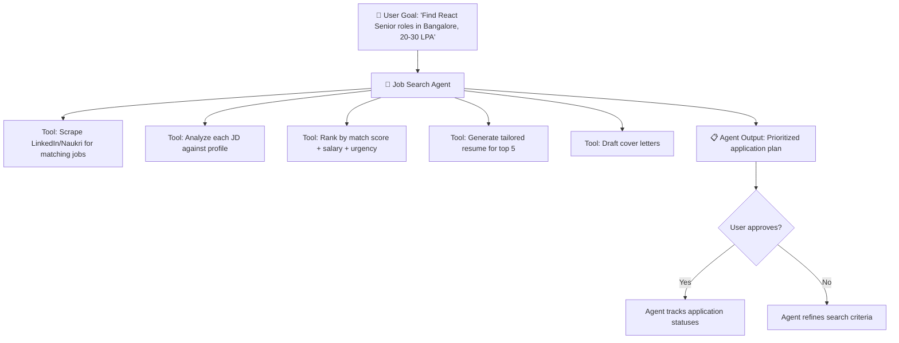
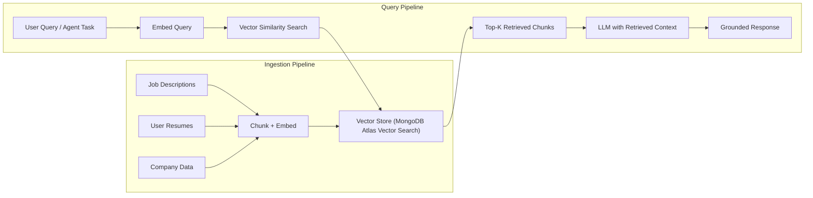
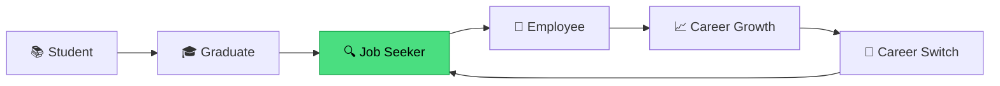
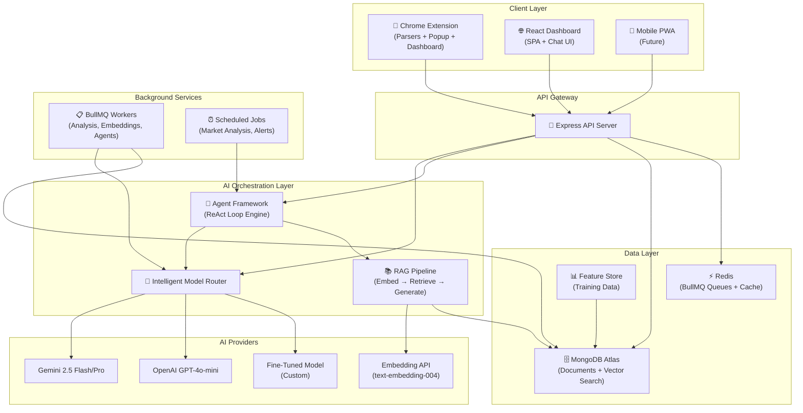

# Gen AI & Agentic AI — Strategy Report for Job Intelligence Collector

> **Project**: Job Intelligence Collector  
> **Date**: July 31, 2026  
> **Scope**: Gen AI integration, Agentic AI architecture, feature proposals, and project expansion roadmap

---

## Table of Contents

1. [Executive Summary](#1-executive-summary)
2. [Current AI Landscape in the Project](#2-current-ai-landscape-in-the-project)
3. [Part 1 — Implementing Gen AI & Agentic AI](#3-part-1--implementing-gen-ai--agentic-ai)
   - [3.1 Generative AI Enhancements](#31-generative-ai-enhancements)
   - [3.2 Agentic AI Architecture](#32-agentic-ai-architecture)
   - [3.3 RAG Pipeline Implementation](#33-rag-pipeline-implementation)
   - [3.4 Fine-Tuning Pipeline](#34-fine-tuning-pipeline)
4. [Part 2 — Features We Can Implement](#4-part-2--features-we-can-implement)
   - [4.1 Immediate Features (Low Effort, High Impact)](#41-immediate-features-low-effort-high-impact)
   - [4.2 Medium-Term Features](#42-medium-term-features)
   - [4.3 Advanced / Differentiator Features](#43-advanced--differentiator-features)
5. [Part 3 — Expanding the Project Scope](#5-part-3--expanding-the-project-scope)
   - [5.1 Platform Expansion](#51-platform-expansion)
   - [5.2 User Base Expansion](#52-user-base-expansion)
   - [5.3 Data & Intelligence Expansion](#53-data--intelligence-expansion)
   - [5.4 Monetization Pathways](#54-monetization-pathways)
6. [Technical Architecture Diagram](#6-technical-architecture-diagram)
7. [Implementation Priority Matrix](#7-implementation-priority-matrix)

---

## 1. Executive Summary

Job Intelligence Collector already has a strong AI foundation — Gemini/OpenAI provider adapters, BullMQ-backed analysis queues, a deterministic scoring engine, resume parsing/generation, interview prep, and a training data pipeline with JSONL fine-tuning export. However, **the current AI usage is primarily single-shot prompt → structured JSON response**, with no memory, no multi-step reasoning, no retrieval-augmented generation (RAG), and no autonomous agent loops.

This report proposes a concrete roadmap to elevate the platform from **"AI-augmented"** to **"AI-native & Agentic"** — where autonomous AI agents proactively manage a user's job search lifecycle, learn from outcomes, and continuously optimize strategies.

---

## 2. Current AI Landscape in the Project

Before proposing changes, here's a map of what already exists and what's stubbed/mocked:

| Component | Status | File(s) |
|---|---|---|
| Gemini provider (job analysis) | ✅ Functional | [GeminiProvider.ts](file:///d:/Personal%20Projects/jobx/apps/backend/src/ai/providers/GeminiProvider.ts) |
| OpenAI provider (failover) | ✅ Functional | [OpenAIProvider.ts](file:///d:/Personal%20Projects/jobx/apps/backend/src/ai/providers/OpenAIProvider.ts) |
| BullMQ analysis queue | ✅ Functional (Redis + memory fallback) | [AnalysisQueue.ts](file:///d:/Personal%20Projects/jobx/apps/backend/src/ai/services/AnalysisQueue.ts) |
| Deterministic scoring engine | ✅ Functional | [ScoringEngine.ts](file:///d:/Personal%20Projects/jobx/apps/backend/src/ai/services/ScoringEngine.ts) |
| Resume parser (PDF/DOCX → Gemini) | ✅ Functional | [ResumeParserService.ts](file:///d:/Personal%20Projects/jobx/apps/backend/src/ai/services/ResumeParserService.ts) |
| Resume tailoring/generation | ✅ Functional | [ResumeGeneratorService.ts](file:///d:/Personal%20Projects/jobx/apps/backend/src/ai/services/ResumeGeneratorService.ts) |
| Interview prep generation | ✅ Functional | [interviewPrep.ts](file:///d:/Personal%20Projects/jobx/apps/backend/src/ai/prompts/interviewPrep.ts) |
| Training data pipeline & JSONL export | ✅ Functional | [TrainingDataPipeline.ts](file:///d:/Personal%20Projects/jobx/apps/backend/src/ai/services/TrainingDataPipeline.ts) |
| Feature store (outcome tracking) | ✅ Functional | [AIFeatureStore.ts](file:///d:/Personal%20Projects/jobx/apps/backend/src/models/AIFeatureStore.ts) |
| Skill/Role taxonomy services | ✅ Functional | [SkillTaxonomyService.ts](file:///d:/Personal%20Projects/jobx/apps/backend/src/ai/services/SkillTaxonomyService.ts), [RoleTaxonomyService.ts](file:///d:/Personal%20Projects/jobx/apps/backend/src/ai/services/RoleTaxonomyService.ts) |
| Embedding generation | 🟡 Stubbed (mock random vectors) | [AIService.ts](file:///d:/Personal%20Projects/jobx/apps/backend/src/services/AIService.ts#L20-L25) |
| Embedding storage schemas | 🟡 Schema exists, not populated | [JobEmbedding.ts](file:///d:/Personal%20Projects/jobx/apps/backend/src/models/JobEmbedding.ts), [ProfileEmbedding.ts](file:///d:/Personal%20Projects/jobx/apps/backend/src/models/ProfileEmbedding.ts), [CompanyEmbedding.ts](file:///d:/Personal%20Projects/jobx/apps/backend/src/models/CompanyEmbedding.ts) |
| Cover letter generation | 🟡 Template-based (no LLM) | [AIService.ts](file:///d:/Personal%20Projects/jobx/apps/backend/src/services/AIService.ts#L100-L115) |
| Skill gap analysis | 🟡 Set-based (no LLM) | [AIService.ts](file:///d:/Personal%20Projects/jobx/apps/backend/src/services/AIService.ts#L30-L48) |
| Semantic job search (vector similarity) | ❌ Not implemented | — |
| Multi-step agentic workflows | ❌ Not implemented | — |
| Conversational AI / Chat interface | ❌ Not implemented | — |
| RAG pipeline | ❌ Not implemented | — |

> [!IMPORTANT]
> The embedding infrastructure (schemas for `JobEmbedding`, `ProfileEmbedding`, `CompanyEmbedding`) and the training data pipeline (`AIFeatureStore` with outcome labels) are already in place — these are **ready-made foundations** for vector search and fine-tuning respectively.

---

## 3. Part 1 — Implementing Gen AI & Agentic AI

### 3.1 Generative AI Enhancements

These are upgrades to the **existing** Gen AI capabilities — making them smarter, more contextual, and more reliable.

#### 3.1.1 — Real Embedding Pipeline (Replace Mock Vectors)

**Current State**: [AIService.generateEmbedding()](file:///d:/Personal%20Projects/jobx/apps/backend/src/services/AIService.ts#L20-L25) returns random 1536-dimensional vectors.

**Proposed Change**:
- Integrate **Gemini Embedding API** (`text-embedding-004`) or **OpenAI text-embedding-3-small** for real vector generation.
- On every job creation/update, generate and store an embedding vector in `JobEmbedding`.
- On every profile update, generate and store a `ProfileEmbedding`.
- Enable **cosine similarity search** across stored embeddings for semantic job matching.

```
┌─────────────────┐    embed()     ┌──────────────────┐    store     ┌──────────────────┐
│ Job Description  │ ───────────►  │ Gemini Embedding │ ─────────►  │ JobEmbedding     │
│ / User Profile   │               │ API              │             │ (MongoDB)        │
└─────────────────┘               └──────────────────┘             └──────────────────┘
```

**Impact**: Unlocks semantic search, "jobs like this" recommendations, and profile-to-job vector matching.

---

#### 3.1.2 — LLM-Powered Cover Letter Generation

**Current State**: [AIService.generateTailoredCoverLetter()](file:///d:/Personal%20Projects/jobx/apps/backend/src/services/AIService.ts#L100-L115) uses string templates.

**Proposed Change**:
- Route through the Gemini/OpenAI provider chain with a structured prompt that takes `{user_profile, job_description, company_culture_signals}` as context.
- Support multiple tone presets: "Formal", "Conversational", "Technical", "Creative".
- Allow iterative editing via a chat-based refinement loop.

---

#### 3.1.3 — Intelligent Skill Gap Analysis with Learning Paths

**Current State**: [AIService.analyzeSkillGap()](file:///d:/Personal%20Projects/jobx/apps/backend/src/services/AIService.ts#L30-L48) does a simple set-difference operation.

**Proposed Change**:
- Use Gemini to generate a **prioritized learning roadmap** for each missing skill, factoring in:
  - How critical the skill is for the target role
  - The user's existing transferable skills
  - Estimated time-to-learn based on adjacent skill familiarity
- Generate links to relevant courses, certifications, and project ideas.

---

#### 3.1.4 — Multi-Model Intelligent Routing

**Current State**: Provider failover is sequential — Gemini first, then OpenAI.

**Proposed Change**:
- Implement **task-aware model routing**:
  - Fast tasks (skill extraction, classification) → `gemini-2.0-flash-lite`
  - Complex reasoning (interview prep, resume tailoring) → `gemini-2.5-pro`
  - Embeddings → `text-embedding-004`
  - Cost-sensitive batch operations → `gpt-4o-mini`
- Route based on task complexity, latency requirements, and cost budgets.

---

### 3.2 Agentic AI Architecture

This is the **transformational upgrade** — moving from single-shot LLM calls to autonomous, multi-step AI agents that execute complex workflows.

#### 3.2.1 — Job Search Agent (Autonomous Application Orchestrator)

An **autonomous agent** that manages the user's entire job search lifecycle:



**Architecture**:
- Built on a **ReAct (Reasoning + Acting)** loop using Gemini function calling.
- Agent has access to **tools**: job scraper, profile analyzer, resume generator, cover letter writer, application tracker.
- Agent maintains **state** across steps using a conversation memory buffer stored in MongoDB.
- User gives a **natural language goal**, and the agent breaks it into sub-tasks autonomously.

**Implementation Plan**:

```typescript
// New file: apps/backend/src/ai/agents/JobSearchAgent.ts
interface AgentTool {
  name: string;
  description: string;
  parameters: Record<string, any>;
  execute: (params: any) => Promise<any>;
}

class JobSearchAgent {
  private tools: AgentTool[];
  private memory: ConversationMemory;
  private maxSteps: number = 10;
  
  async run(userGoal: string): Promise<AgentResult> {
    // ReAct loop:
    // 1. THINK — reason about the current state and goal
    // 2. ACT — select and call a tool
    // 3. OBSERVE — process the tool output
    // 4. Repeat until goal is achieved or max steps reached
  }
}
```

---

#### 3.2.2 — Interview Coach Agent

A **conversational agent** that conducts mock interviews:

- Generates role-specific questions from the stored `JobAnalysis` data.
- Conducts a multi-turn mock interview via a chat interface.
- Evaluates user's answers in real-time using Gemini.
- Provides feedback on: technical accuracy, communication clarity, STAR framework usage.
- Tracks improvement over multiple sessions.

**Key Differentiator**: Unlike static Q&A lists (which already exist in `InterviewPrep`), this is an **interactive, adaptive** experience that adjusts difficulty based on performance.

---

#### 3.2.3 — Career Strategy Agent

A **long-running background agent** that continuously monitors the user's career trajectory:

| Agent Responsibility | Trigger | Output |
|---|---|---|
| Market trend analysis | Weekly cron job | "Demand for Go engineers increased 23% this quarter in your target cities" |
| Skill deprecation warnings | Profile skill changes | "jQuery usage in job postings has declined 40% YoY. Consider upskilling to React." |
| Application follow-up reminders | Application status unchanged for 7 days | "You applied to X company 7 days ago. Consider sending a follow-up email." |
| Salary negotiation prep | User marks status as "Offer" | Auto-generate negotiation talking points based on market data |
| Portfolio gap identification | Monthly analysis | "90% of your target roles require Docker. Add a containerized project." |

---

#### 3.2.4 — Agentic Scraping Agent (Self-Healing Parsers)

**Current State**: Site parsers in [parsers/](file:///d:/Personal%20Projects/jobx/apps/extension/src/parsers) use hardcoded CSS selectors that break when sites update their DOM.

**Proposed Change**: Implement an **LLM-powered fallback parser** that:
1. Receives the raw HTML of a job page.
2. Uses Gemini to extract structured job data (`title`, `company`, `location`, `description`, `salary`, `skills`) even when selectors fail.
3. The agent **self-heals**: when a parser throws errors, it automatically falls back to the LLM parser, logs the new DOM structure, and optionally generates updated selector suggestions.

```
┌──────────────┐     fails     ┌──────────────────┐     raw HTML     ┌──────────────────┐
│ CSS Selector │ ───────────►  │ LLM Fallback     │ ──────────────►  │ Gemini: Extract  │
│ Parser       │               │ Parser Agent     │                  │ structured data  │
└──────────────┘               └──────────────────┘                  └──────────────────┘
```

---

### 3.3 RAG Pipeline Implementation

**Retrieval-Augmented Generation** will dramatically improve the quality and personalization of all AI outputs.

#### Architecture



#### What RAG Enables

| Use Case | Without RAG | With RAG |
|---|---|---|
| Resume tailoring | Generic rewrites | References actual JD phrases and company-specific terminology |
| Interview prep | Generic questions | Questions grounded in the company's actual tech stack and past interview reports |
| Skill recommendations | Based on job title keywords | Grounded in what similar companies actually require |
| Cover letters | Template-based | References specific company values, recent news, and culture signals |
| Job recommendations | Keyword matching | Semantic similarity to user's actual experience descriptions |

#### Implementation Using Existing Infrastructure

> [!TIP]
> MongoDB Atlas supports **vector search** natively. Since the project already uses MongoDB + Mongoose, this is the lowest-friction path — no need for a separate vector DB like Pinecone or Weaviate.

1. Enable **Atlas Vector Search** index on `JobEmbedding.vector`, `ProfileEmbedding.vector`, `CompanyEmbedding.vector`.
2. Replace [AIService.generateEmbedding()](file:///d:/Personal%20Projects/jobx/apps/backend/src/services/AIService.ts#L20-L25) with real Gemini embedding calls.
3. On job ingestion, chunk the description, embed each chunk, and store.
4. On query, embed the query, perform `$vectorSearch` aggregation, and inject top-K results into the prompt context.

---

### 3.4 Fine-Tuning Pipeline

The project already has a [TrainingDataPipeline](file:///d:/Personal%20Projects/jobx/apps/backend/src/ai/services/TrainingDataPipeline.ts) that logs features and exports JSONL. Here's how to complete the loop:

#### Phase 1 — Data Collection (Already Built ✅)
- [AIFeatureStore](file:///d:/Personal%20Projects/jobx/apps/backend/src/models/AIFeatureStore.ts) captures `skillsOverlap`, `projectsMatch`, `experienceMatch`, `calculatedMatchScore`, and `actualOutcome`.
- [TrainingDataPipeline.exportFineTuningDataset()](file:///d:/Personal%20Projects/jobx/apps/backend/src/ai/services/TrainingDataPipeline.ts#L60-L101) exports in OpenAI fine-tuning JSONL format.

#### Phase 2 — Feedback Loop (Partially Built 🟡)
- Add an explicit **thumbs up/down** + optional text feedback on every AI analysis result.
- Store in [AIRecommendationFeedback](file:///d:/Personal%20Projects/jobx/apps/backend/src/models/AIRecommendationFeedback.ts).
- Use feedback signals to weight training samples (positive outcomes → higher weight).

#### Phase 3 — Model Fine-Tuning (Proposed 🔴)
- Export JSONL dataset from the telemetry dashboard.
- Fine-tune `gpt-4o-mini` or `gemini-1.5-flash` on user-specific matching patterns.
- Deploy fine-tuned model as a dedicated provider in the [provider chain](file:///d:/Personal%20Projects/jobx/apps/backend/src/ai/services/AnalysisQueue.ts#L33).
- A/B test fine-tuned vs. base model and track outcome differences.

---

## 4. Part 2 — Features We Can Implement

### 4.1 Immediate Features (Low Effort, High Impact)

These can be built within **1–2 weeks** each, using existing infrastructure.

#### 4.1.1 — AI Chat Assistant (Extension Popup + Dashboard)

A **conversational interface** embedded in both the Chrome extension popup and the dashboard:

- **In the Extension**: "What does this job require?", "Am I a good fit?", "What skills am I missing?"
- **In the Dashboard**: "Show me my best matches this week", "Why was I rejected from Company X?", "Draft a follow-up email"
- Built using Gemini's multi-turn chat API with conversation history stored in MongoDB.
- Context-aware: automatically injects the current page's job data (extension) or selected job (dashboard).

---

#### 4.1.2 — Smart Application Status Predictions

Using the existing [AIFeatureStore](file:///d:/Personal%20Projects/jobx/apps/backend/src/models/AIFeatureStore.ts) outcome data:

- Train a simple classifier (or use Gemini with few-shot prompting) to predict `P(Interview | profile, job_features)`.
- Display a **"Likelihood of Interview" percentage** on each job card.
- Show historical accuracy: "Based on 47 past applications, jobs with 70%+ match scores led to interviews 68% of the time."

---

#### 4.1.3 — Automated Resume Variant Selection

When a user applies to a job:
1. System checks all existing [ResumeVersions](file:///d:/Personal%20Projects/jobx/apps/backend/src/models/ResumeVersion.ts).
2. Uses embedding similarity to find the closest-matching variant.
3. If no good match exists, auto-generates a new tailored variant using [ResumeGeneratorService](file:///d:/Personal%20Projects/jobx/apps/backend/src/ai/services/ResumeGeneratorService.ts).
4. Recommends: "Use Resume v3 (React-focused) for this job. It has a 78% match vs. your default resume at 52%."

---

#### 4.1.4 — AI-Powered Job Description Summarizer

One-click summarization in the extension popup:
- **TL;DR**: 3-sentence summary of the role.
- **Red Flags**: Unrealistic requirements, vague descriptions, signs of high turnover.
- **Green Flags**: Competitive salary, growth opportunities, modern tech stack.
- **Culture Signals**: Remote-friendly, startup vs. enterprise, work-life balance indicators.

---

#### 4.1.5 — Salary Intelligence & Negotiation Helper

Enhance the existing `salaryEstimate` field in [JobAnalysis](file:///d:/Personal%20Projects/jobx/apps/backend/src/models/JobAnalysis.ts):
- Use Gemini to estimate salary ranges based on role, location, seniority, and company size.
- Compare against stored salary data from previously scraped jobs.
- Generate negotiation talking points when a user receives an offer.

---

### 4.2 Medium-Term Features

These require **3–6 weeks** of development and potentially new infrastructure.

#### 4.2.1 — Semantic Job Search ("Find Jobs Like This")

- User selects a job they liked → system finds semantically similar jobs from their saved collection using vector similarity.
- User describes an ideal role in natural language → system searches across all saved jobs + scraped listings.
- Powered by the RAG pipeline (Section 3.3).

---

#### 4.2.2 — AI-Powered Application Tracker with Timeline Intelligence

Upgrade the existing [Application](file:///d:/Personal%20Projects/jobx/apps/backend/src/models/Application.ts) model:

- **Auto-detect status changes**: Parse email confirmations (if user connects email) to automatically update application status.
- **Smart reminders**: "It's been 5 business days since your interview with Company X. Draft a thank-you/follow-up?"
- **Outcome analytics dashboard**: Visualize funnel metrics (Applied → Screen → Interview → Offer) with AI-generated insights on what's working.

---

#### 4.2.3 — Company Intelligence Engine

Leverage scraped company data from [LinkedIn Company parser](file:///d:/Personal%20Projects/jobx/apps/extension/src/parsers/LinkedInParser.ts) and [Company model](file:///d:/Personal%20Projects/jobx/apps/backend/src/models/Company.ts):

- **Company dossier**: Auto-generate a research brief before an interview (recent news, glassdoor sentiment, tech stack, funding stage).
- **Culture fit scoring**: Match company culture signals against user's stated preferences.
- **Hiring patterns**: "This company has posted 15 React roles in the last 3 months → high demand, likely flexible on requirements."

---

#### 4.2.4 — AI Email/Message Drafting Suite

Generate professional communications:
- **Application follow-up emails** (contextual, referencing specific JD points)
- **LinkedIn connection requests** to recruiters (personalized, non-generic)
- **Thank-you notes** post-interview (referencing discussion topics)
- **Salary negotiation emails** (backed by market data)
- **Rejection response / future interest emails**

---

#### 4.2.5 — Collaborative Job Search (Multi-User Intelligence)

If expanded to support multiple users:
- **Anonymized market intelligence**: "78% of users with your skill set who applied to similar roles received interviews."
- **Referral network**: Match users who work at companies where other users are applying.
- **Shared company reviews and interview experiences**.

---

### 4.3 Advanced / Differentiator Features

These are **high-effort, high-reward** features that would set the platform apart.

#### 4.3.1 — AI Portfolio Generator

Analyze user's GitHub repos, projects, and experiences to:
- Auto-generate a **personal portfolio website** (HTML/CSS/JS).
- Optimize project descriptions for recruiter readability.
- Create compelling README files for GitHub repositories.
- Generate a technical blog post about a selected project.

---

#### 4.3.2 — Real-Time Market Intelligence Dashboard

A dashboard showing:
- **Trending skills** by geography and role category (from aggregated JD analysis).
- **Salary heatmaps** by city and role.
- **Demand forecasting**: "Based on 6-month trend, Rust demand in Bangalore will increase 35% by Q1."
- **Company hiring velocity**: Track how frequently companies post new roles.

All powered by aggregating and analyzing the growing corpus of scraped job data.

---

#### 4.3.3 — AI-Powered Networking Agent

An agent that:
1. Identifies **key people to connect with** at target companies (using LinkedIn scraping).
2. Drafts **personalized outreach messages** based on shared interests/technologies.
3. Suggests **optimal timing** for outreach (e.g., after company posts a new role).
4. Tracks networking pipeline: Contact → Messaged → Responded → Referral.

---

#### 4.3.4 — Voice-Powered Interview Simulator

Using browser Web Speech API + Gemini:
- **Live voice mock interviews**: User speaks, AI evaluates and responds.
- **Real-time transcription** and analysis.
- **Body language tips** (if webcam is enabled via MediaStream API).
- **Post-session analytics**: Filler word count, response time, confidence score, technical accuracy.

---

## 5. Part 3 — Expanding the Project Scope

### 5.1 Platform Expansion

| Current | Expansion |
|---|---|
| Chrome extension only | **Firefox**, **Edge**, and **Safari** extension ports (WebExtension API is cross-browser compatible with MV3) |
| Web dashboard (React SPA) | **Mobile app** (React Native or PWA) for on-the-go job tracking |
| Manual job scraping (user visits page) | **Background scraping service** — scheduled crawls of job boards based on saved search queries |
| Single-user local storage (Dexie.js) | **Cloud sync** — optional encrypted cloud backup of extension data to the backend |

---

### 5.2 User Base Expansion

#### From Individual → Team/Enterprise

| Feature | Individual | Team/Enterprise |
|---|---|---|
| Job tracking | Personal Kanban | Shared hiring pipeline for recruiting teams |
| Resume management | Single user | Candidate resume database for HR |
| Analytics | Personal metrics | Team-wide hiring funnel analytics |
| AI analysis | Self-matching | Candidate-to-role matching for recruiters |

#### From Job Seekers → Full Career Lifecycle



- **Students**: Course recommendations, internship matching, portfolio building.
- **Job Seekers**: Full current feature set + enhancements from this report.
- **Employees**: Skill development tracking, internal mobility suggestions, continuous market positioning.
- **Career Switchers**: Transferable skill mapping, bridge-role identification, reskilling roadmaps.

---

### 5.3 Data & Intelligence Expansion

#### 5.3.1 — Job Market Knowledge Graph

Build a **knowledge graph** connecting:

```
[Skills] ←→ [Roles] ←→ [Companies] ←→ [Industries] ←→ [Locations] ←→ [Salary Ranges]
```

- Stored in MongoDB with graph-like relationships or migrated to **Neo4j** for complex traversals.
- Powers queries like: "What's the shortest skill path from my current profile to a Staff Engineer role at Google?"
- Visualized as an interactive network graph in the dashboard.

---

#### 5.3.2 — Competitive Intelligence Layer

- **Application competition estimation**: "Based on posting age and company hiring velocity, approximately 200–400 people have applied to this role."
- **Skill rarity scoring**: "Only 12% of candidates in your market have both Kubernetes and Terraform — this is your competitive advantage."
- **Timing optimization**: "Applications submitted within the first 48 hours of posting have a 3x higher response rate."

---

#### 5.3.3 — Integration Ecosystem

| Integration | Value |
|---|---|
| **Google Calendar** | Auto-block interview prep time, sync interview schedules |
| **Gmail / Outlook** | Auto-parse application confirmations and status update emails |
| **GitHub** | Auto-import projects, analyze contribution patterns, calculate "code portfolio score" |
| **LinkedIn API** | Bi-directional sync of profile data, connection suggestions |
| **Notion / Obsidian** | Export job research notes and interview prep materials |
| **Slack / Discord** | Job alerts, daily digest notifications, team collaboration |

---

### 5.4 Monetization Pathways

| Tier | Price | Features |
|---|---|---|
| **Free** | $0 | Extension + local storage, 5 AI analyses/month, basic dashboard |
| **Pro** | $12/month | Unlimited AI analyses, resume tailoring, interview prep, cloud sync |
| **Premium** | $25/month | Agentic workflows, career strategy agent, salary intelligence, priority AI (Gemini Pro models) |
| **Enterprise** | Custom | Multi-user, recruiter tools, API access, custom model fine-tuning, SSO |

**Additional Revenue Streams**:
- Anonymized market intelligence reports sold to recruiting firms.
- Premium resume template marketplace.
- Career coaching referral partnerships.

---

## 6. Technical Architecture Diagram



---

## 7. Implementation Priority Matrix

| Priority | Feature | Effort | Impact | Dependencies |
|:---:|---|:---:|:---:|---|
| 🔴 **P0** | Real embedding pipeline (replace mock vectors) | Low | High | Gemini/OpenAI embedding API key |
| 🔴 **P0** | AI Chat Assistant (extension + dashboard) | Medium | Very High | Gemini multi-turn chat API |
| 🔴 **P0** | LLM-powered cover letter generation | Low | High | Existing provider chain |
| 🟠 **P1** | RAG pipeline with MongoDB Atlas Vector Search | Medium | Very High | Real embeddings (P0) |
| 🟠 **P1** | Intelligent skill gap analysis with learning paths | Low | High | Existing Gemini integration |
| 🟠 **P1** | Job description summarizer (extension) | Low | Medium | Existing Gemini integration |
| 🟠 **P1** | Self-healing LLM parser fallback | Medium | High | Gemini API |
| 🟡 **P2** | Job Search Agent (autonomous) | High | Very High | RAG pipeline (P1), Agent framework |
| 🟡 **P2** | Interview Coach Agent (conversational) | High | Very High | Multi-turn chat, InterviewPrep data |
| 🟡 **P2** | Semantic job search ("jobs like this") | Medium | High | RAG pipeline (P1) |
| 🟡 **P2** | Application status predictions | Medium | Medium | Sufficient outcome data in FeatureStore |
| 🟡 **P2** | Email/message drafting suite | Medium | Medium | Gemini API |
| 🟢 **P3** | Career Strategy Agent (background) | High | High | Agent framework (P2), Cron jobs |
| 🟢 **P3** | Company Intelligence Engine | Medium | Medium | Company scraping data |
| 🟢 **P3** | Market intelligence dashboard | High | Medium | Aggregated JD data |
| 🟢 **P3** | Fine-tuning pipeline (end-to-end) | High | Medium | Sufficient training data |
| 🔵 **P4** | Mobile PWA | High | Medium | API completeness |
| 🔵 **P4** | Multi-user / enterprise features | Very High | High | Auth overhaul, data isolation |
| 🔵 **P4** | Voice interview simulator | Very High | High | Web Speech API, streaming |
| 🔵 **P4** | Networking agent | High | Medium | LinkedIn scraping compliance |

> [!NOTE]
> **Recommended starting point**: Tackle the three **P0 items** first — real embeddings, AI chat assistant, and LLM cover letters. These unlock the foundation for everything else and deliver immediate user-visible value with relatively low effort.

---

*This report serves as a strategic blueprint. Each section can be broken down into detailed implementation plans with API contracts, database migrations, and UI wireframes as development begins.*
